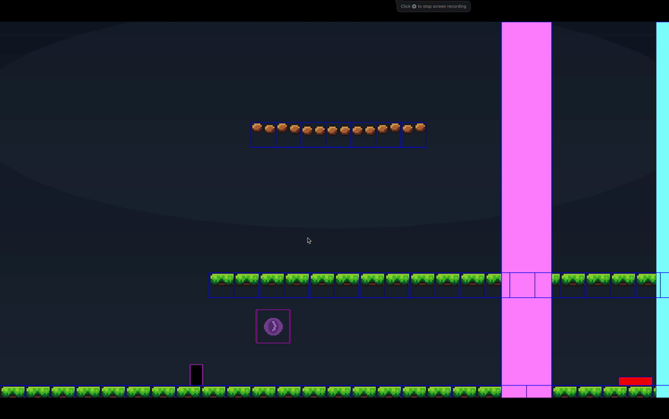
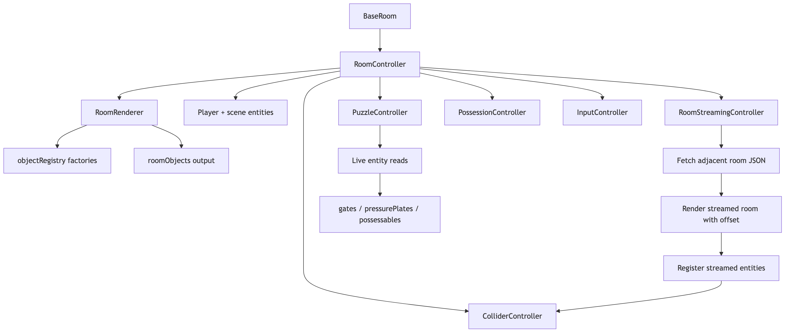
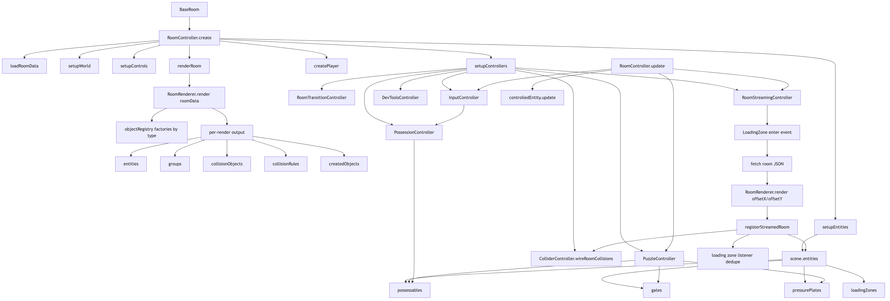

# Will o' the Wisp (GhostGame)

Will o' the Wisp is a Phaser 4 puzzle-platformer prototype centered around a ghost character who can possess world objects to solve traversal and logic puzzles.

This project also serves as a mini engine / tooling sandbox focused on data-driven rooms, in-game authoring, and room streaming in a single active scene.

## Portfolio Focus

This repository is intended as a portfolio project demonstrating:

- JavaScript architecture and controller orchestration
- JSON-driven game content pipelines
- Runtime room streaming and system synchronization
- In-game editor tooling and save/reload workflows
- Testing discipline with Vitest

## Current State

The project is in active prototype development. Current phase priorities:

- Author rooms in the in-game editor
- Save/reload room JSON
- Stream adjacent rooms without scene resets
- Keep collisions, entities, and controllers consistent after streaming

## Gameplay Preview

### Core Movement and Possession



## Architecture Highlights

- `BaseRoom` stays lean and delegates to room controllers.
- `RoomController` orchestrates setup and frame updates.
- `RoomRenderer` creates runtime objects from room JSON via an object registry.
- `RoomStreamingController` loads and renders room JSON into the same active scene.
- `LevelEditor` delegates behavior to editor-focused controllers.
- Runtime systems are moving toward validated object contracts (`id`, `targetIds`) with legacy fallback support where needed.

## Architecture Diagrams





## Tech Stack

- Phaser 4
- Vite
- JavaScript (ES modules)
- Vitest
- Prettier

## Getting Started

Requirements:

- Node.js 24+ (recommended based on current setup)

Install:

```bash
npm install
```

Run game:

```bash
npm run dev
```

Run game + local save server:

```bash
npm run dev:editor
```

Build:

```bash
npm run build
```

Preview production build:

```bash
npm run preview
```

## Asset/Editor Pipeline Scripts

```bash
npm run manifest
npm run normalize-assets
npm run palette
```

`predev:editor` runs these before `dev:editor`.

## Testing

Run all tests:

```bash
npm run test
```

Watch mode:

```bash
npm run test:watch
```

## Project Docs

- [Project Overview](./docs/PROJECT_OVERVIEW.md)
- [ADR Index](./docs/adr)
- [Architecture Overview](./docs/ARCHITECTURE_OVERVIEW.md)
- [Architecture Deep Dive](./docs/ARCHITECTURE_DEEP_DIVE.md)
- [Asset Attribution](./docs/ASSET_ATTRIBUTION.md)
- [Working Agreement](./WORKING_AGREEMENT.md)

## Source Availability and Rights

This source is published for portfolio review and development progress visibility.

All rights are reserved. No permission is granted to copy, modify, redistribute, or use this codebase or assets for commercial or non-commercial purposes without explicit written permission.

See [LICENSE](./LICENSE) for details.
