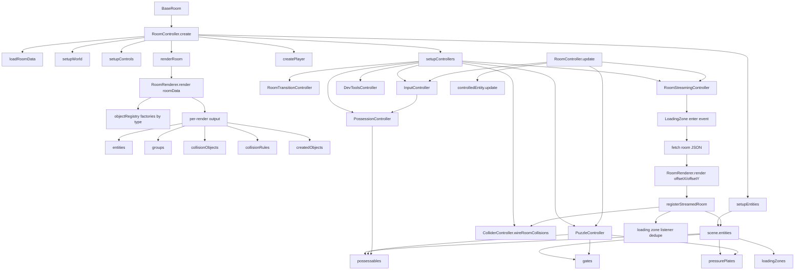

# Architecture Deep Dive

This diagram captures the deeper controller and lifecycle flow used during room setup, update, and streaming registration.

## Lifecycle Intent

- `BaseRoom` and `LevelEditor` stay orchestration-focused.
- `RoomRenderer` is the runtime creation boundary for JSON-authored content.
- `RoomStreamingController` owns same-scene adjacent-room streaming and registration.
- Collision and puzzle systems consume live entity collections after streaming updates.
